# CV
## Biography

Sujith brings more than 24 years of IT experience, combined with excellent communication and presentation skills. He is an efficient, analytical, positive thinking professional who has successfully demonstrated the ability of understanding business requirements, specifying systems, developing working software and designing Azure solutions.

As a certified **Azure Solutions Architect** he demonstrates skills and knowledge to advise stakeholders and translate business requirements into secure, scalable, and reliable solutions. He has advanced experience and knowledge across various aspects of IT operations, including networking, virtualization, identity, security, business continuity, disaster recovery, data management, budgeting, and governance. He also understands how managing decisions in each area affect an overall solution.

As a certified **Cybersecurity Architect** he has subject matter expertise in designing and evolving the cybersecurity strategy to protect an organization’s mission and business processes across all aspects of the enterprise architecture.

As a certified **DevOps Engineer** he demonstrates the ability to combine people, process, and technologies to continuously deliver valuable products and services that meet end user needs and business objectives. He streamlines delivery by optimizing practices, improving communications and collaboration, and creating automation.

As a certified partner for **GitHub Actions** he validates subject matter expertise with applying continuous integration/continuous delivery (CI/CD) patterns and practices using GitHub Actions in the enterprise.

As a certified partner for **GitHub Advanced Security** he validates subject matter expertise with applying software supply chain security patterns and practices with GitHub Advanced Security in the enterprise.

As a certified partner for **GitHub Administration** he validates subject matter expertise with the deployment and administration of GitHub Enterprise as well as how to provide support for GitHub users in the enterprise.

As a certified partner for **GitHub Foundations** he validates subject matter expertise by measuring entry-level skills with GitHub basics like repositories, commits, branching, markdowns, and project management.

As an **Accredited Trainer** for GitHub he is allowed to give training for

* GitHub Actions
* GitHub for Developers
* GitHub Advanced Security Getting Started
* GitHub Administration
* GitHub Migrations
* GitHub Enterprise Importer
* GitHub Copilot for Business Fundamentals

As a certified **Azure Cosmos DB Developer** he shows subject matter expertise designing, implementing, and monitoring cloud-native applications that store and manage data. His responsibilities include designing and implementing data models and data distribution, loading data into an Azure Cosmos DB database, and optimizing and maintaining the solution. He integrates the solution with other Azure services. He also designs, implements, and monitors solutions that consider security, availability, resilience, and performance requirements. He has solid knowledge and experience developing apps for Azure and working with Azure Cosmos DB database technologies. He should be proficient at developing applications by using the Core (SQL) API and SDKs, writing efficient queries and creating appropriate index policies, provisioning and managing resources in Azure, and creating server-side objects with JavaScript. He should be able to interpret JSON, read C# or Java code, and use PowerShell.

As a certified **Azure Identity and Access Administrator** he validates the skills and knowledge to design, implement, and operate an organization’s identity and access management systems using Azure AD. He provides a seamless experience and self-service management capabilities for all users. He is responsible for troubleshooting, monitoring, and reporting of the identity and access environment.

As a certified **Azure Network Engineer** he validates skills and subject matter expertise in planning, implementing, and maintaining Azure networking solutions, including hybrid networking, connectivity, routing, security, and private access to Azure services. He deploys networking solutions using Azure Portal and other methods, including PowerShell, Azure Command-Line Interface (CLI), and Azure Resource Manager templates (ARM templates).

As a certified **Azure AI Engineer** he validates the skills and knowledge to use Cognitive Services, Machine Learning, and Knowledge Mining to architect and implement Microsoft AI solutions involving natural language processing, speech, computer vision, bots, and agents.

As a certified **Azure Administrator** he validates the skills and knowledge to implement, manage, and monitor an organization’s Azure environment. He has a deep understanding of each implementing, managing, and monitoring identity, governance, storage, compute, and virtual networks in a cloud environment, plus provision, size, monitor, and adjust resources, when needed.

As a certified **Azure Security Engineer** he demonstrates the skills and knowledge to implement security controls and threat protection, manage identity and access, and protect data, applications, and networks in cloud and hybrid environments as part of end-to-end infrastructure.

As a certified **Azure Developer** he demonstrates the skills and knowledge to design, build, test, and maintain cloud applications and services on Microsoft Azure. He participates in all phases of cloud development from requirements definition and design, to development, deployment, and maintenance.

As a HashiCorp Certified: **Terraform Associate**, he possesses an in-depth understanding of the foundational concepts, skills, and practical applications of HashiCorp Terraform, the open-source infrastructure as code software tool. This certification underscores his proficiency in writing, planning, and creating automated infrastructure with Terraform, enabling scalable, efficient, and secure deployments. With a keen grasp on both the theoretical and practical aspects of Terraform, he adeptly navigates its ecosystem to implement and manage infrastructure across a variety of cloud providers. Sujith’s expertise extends to understanding the significance of Terraform Enterprise for businesses seeking to enhance their infrastructure management practices with advanced features for collaboration, governance, and self-service capabilities. His certification is a testament to his ability to leverage Terraform to automate and optimize infrastructure, aligning IT resources with business needs and accelerating digital transformation.

As a **Azure DevOps professional**, he brings a comprehensive mastery of Azure DevOps services and principles, demonstrating his capability to streamline software development and delivery processes. This certification validates his extensive knowledge and hands-on experience in using Azure DevOps to foster a culture of collaboration and communication between development and operations teams. Sujith excels in implementing DevOps practices such as continuous integration (CI), continuous delivery (CD), automation of workflows, and monitoring across cloud and hybrid environments. His proficiency encompasses managing source code, facilitating agile project management, automating builds and deployments, and optimizing feedback mechanisms for continuous improvement. The certification confirms Sujith's skills in aligning software development practices with business objectives, ensuring rapid, reliable, and efficient delivery of high-quality software solutions. His expertise in Azure DevOps positions him as a key architect in the transformation towards a more agile, productive, and secure development lifecycle.

As **Lead developer**, he has carried the full weight of software development in medium-sized software firms in the past few years. As such he is guiding other developers, streamlining development, defining standards, organizing code reviews, exploring new technologies, etc. Having worked on the same products for several years, he has developed a deeper understanding of the evolution of software.

As an **AWS Cloud Quest Cloud Practitioner** he has demonstrated basic solution building knowledge using AWS services and has a fundamental understanding of AWS Cloud concepts. He has acquired hands-on experience with compute, networking, database and security services.

He is an excellent team player, capable of working under pressure and without supervision. He is well organized, self-motivated, and has demonstrated important skills in dealing with issues and resolving them prior to becoming problems. He is an easy learning person used to acquire new knowledge about customer systems, standards, tools and trends. He is eager to learn new technologies and is continuously extending his knowledge.

## Experience

::timeline::

[
    {
    "title": "[Xebia](https://xebia.com) - Azure Architect | DevOps Enabler | GitHub Enthusiast | Trainer",
    "content": "The company follows the principles of Authority, Focus, and Values, guiding every decision. Authority drives the mission to be the best in the field, individually and collectively. This ambition fuels the company and its employees to strive for excellence. They assist clients with Azure, GitHub, DevOps, cloud-native technologies, assessments, continuous integration and delivery, infrastructure as code, and training programs.",
    "icon": ":material-github:",
    "sub_title": "2023-06-12 - Present"
},
{
    "title": "[Ordina](https://ordina.be) - Azure Architect",
    "content": "Ordina, AHEAD OF CHANGE, focuses on using IT applications to solve business and social problems. Responsibilities include helping clients architect Azure infrastructure, implement DevOps practices, manage Azure governance, redesign applications using PaaS components, conduct performance and security audits, and manage costs. Additionally, internal projects involved product portfolio development, sales support, and training sessions on various topics like Azure, Kubernetes, and DevOps.",
    "icon": ":custom-icon:",
    "sub_title": "2021-01-18 - 2023-06-09"
},
{
    "title": "[Arxus](https://arxus.eu) - Cloud Solutions Architect",
    "content": "At Arxus, a Managed Services Provider, the focus was on offering tailored Azure, Office 365, and Microsoft 365 solutions. Responsibilities included architecting Azure infrastructure, managing DevOps, ensuring Azure governance, redesigning applications using Azure PaaS, and optimizing cloud environments. Additionally, internal projects involved supporting sales, developing managed services, and training teams on Azure, Kubernetes, and DevOps.",
    "icon": ":custom-icon:",
    "sub_title": "2019-07-01 - 2021-01-18"
},
{
    "title": "[Euricom](https://euri.com) - Senior Azure Consultant and Senior .NET Developer",
    "content": "At Euricom, responsibilities included supporting RFP processes, conducting TCO assessments, redesigning application architecture, optimizing PaaS environments for performance and cost, and providing cloud architecture coaching. Additionally, as a Senior .NET Developer, the focus was on delivering immediate business value using 'Lean Manufacturing' principles to develop projects within tight timelines.",
    "icon": ":custom-icon:",
    "sub_title": "2012-11-01 - 2019-06-30"
},
{
    "title": "[Ordina](https://ordina.be) - Senior .NET Developer",
    "content": "At Ordina, worked as a consultant specializing in .NET, focusing on developing Windows Forms, ASP.NET, WPF, WCF, and other enterprise technologies for various client projects.",
    "icon": ":custom-icon:",
    "sub_title": "2009-12-01 - 2012-10-31"
},
{
    "title": "[ICMS](https://www.knowliah.com/) - Software Developer",
    "content": "At ICMS, developed solutions using .NET, Windows Forms, ASP.NET, ADO.NET, SQL Server, Lucene, and Solr technologies for various projects.",
    "icon": ":custom-icon:",
    "sub_title": "2006-12-01 - 2009-12-31"
},
{
    "title": "[Sogeti](https://www.sogeti.be/) - Software Developer",
    "content": "At Sogeti, provided consultancy services with a focus on VB6, ASP, and SQL Server technologies.",
    "icon": ":custom-icon:",
    "sub_title": "2006-08-01 - 2006-11-30"
},
{
    "title": "[Sofico](https://www.sofico.be/) - Software Developer",
    "content": "At Sofico, developed solutions using JAVA and PL-SQL for internal projects.",
    "icon": ":custom-icon:",
    "sub_title": "2004-04-01 - 2006-07-31"
},
{
    "title": "LBCO - Software Developer",
    "content": "At LBCO, worked on development using Magic eDeveloper and served as a System Engineer.",
    "icon": ":custom-icon:",
    "sub_title": "2002-10-01 - 2004-03-31"
},
{
    "title": "[Info Support](https://www.infosupport.com) - Software Developer",
    "content": "At Info Support, provided consultancy services specializing in VB6, SQL Server, and Crystal Reports for various client projects.",
    "icon": ":custom-icon:",
    "sub_title": "2000-07-01 - 2002-09-30"
}

]

::/timeline::

## Accomplishments

-   :fontawesome-brands-microsoft:{ .lg .middle } __[Applied Skills  - Migrate SQL Server workloads to Azure SQL Database](https://learn.microsoft.com/en-us/credentials/applied-skills/migrate-sql-workloads-azure-sql-database/)__

    ---

    Learners demonstrate the ability to assess and migrate SQL Server workloads to Azure SQL Database

    [:octicons-arrow-right-24: certificate](https://learn.microsoft.com/api/credentials/share/en-us/SujithQuintelier/BAFE8995F6D16FE0?sharingId=B2D5696D597C46D3)

-   :fontawesome-brands-microsoft:{ .lg .middle } __[Microsoft Certified: Azure AI Fundamentals](https://learn.microsoft.com/en-us/credentials/certifications/azure-ai-fundamentals/)__

    ---

    Learners demonstrate fundamental AI concepts related to the development of software and services of Microsoft Azure to create AI solutions.

-   :fontawesome-brands-microsoft:{ .lg .middle } __[Microsoft Certified: Azure Fundamentals](https://learn.microsoft.com/en-us/credentials/certifications/azure-fundamentals)__

    ---

    Learners demonstrate foundational knowledge of cloud concepts, core Azure services, plus Azure management and governance features and tools.

-   :fontawesome-brands-github:{ .lg .middle } __GitHub Sales Professional__

    ---

    Learners demonstrate to position and sell GitHub Enterprise solutions.

    [:octicons-arrow-right-24: certificate](https://github.com/sujithq/sujithq/raw/master/assets/github/GHSP.pdf)

-    __[Applied Skills  - Implement security through a pipeline using Azure DevOps](https://learn.microsoft.com/en-us/credentials/applied-skills/implement-security-through-pipeline-using-devops/)__

    ---

    Learners demonstrate the ability to implement secure Azure Pipelines.

    [:octicons-arrow-right-24: certificate](https://learn.microsoft.com/en-us/users/sujithq/credentials/8ebf6803f8a567c0?sharingId=8EBF6803F8A567C0)

-   :fontawesome-brands-microsoft:{ .lg .middle } __[Applied Skills  - Build an Azure AI Vision solution](https://learn.microsoft.com/en-us/credentials/applied-skills/build-azure-ai-vision-solution/)__

    ---

    Learners demonstrate the ability to build computer vision solutions by using Azure AI Vision.

    [:octicons-arrow-right-24: certificate](https://learn.microsoft.com/api/credentials/share/en-us/SujithQuintelier/78424700D5CCDF7?sharingId=B2D5696D597C46D3)

-   :fontawesome-brands-microsoft:{ .lg .middle } __[Applied Skills  - Create an intelligent document processing solution with Azure AI Document Intelligence](https://learn.microsoft.com/en-us/credentials/applied-skills/create-intelligent-document-solution-azure-ai/)__

    ---

    Learners demonstrate the ability to create and implement Azure AI Document Intelligence solutions.

    [:octicons-arrow-right-24: certificate](https://learn.microsoft.com/api/credentials/share/en-us/SujithQuintelier/36CC4D565FA0900B?sharingId=B2D5696D597C46D3)

-   :fontawesome-brands-microsoft:{ .lg .middle } __[Applied Skills  - Build a natural language processing solution with Azure AI Language](https://learn.microsoft.com/en-us/credentials/applied-skills/build-natural-language-solution-azure-ai/)__

    ---

    Learners demonstrate the ability to create a natural language processing (NLP) solution by using Azure AI Language.

    [:octicons-arrow-right-24: certificate](https://learn.microsoft.com/api/credentials/share/en-us/SujithQuintelier/8975AA062F21AEE2?sharingId=B2D5696D597C46D3)

-   :fontawesome-brands-microsoft:{ .lg .middle } __[Applied Skills  - Deploy and configure Azure Monitor](https://learn.microsoft.com/en-us/credentials/applied-skills/deploy-and-configure-azure-monitor/)__

    ---

    Learners demonstrate the ability to deploy and configure monitoring for Azure infrastructure.

    [:octicons-arrow-right-24: certificate](https://learn.microsoft.com/api/credentials/share/en-us/SujithQuintelier/DD793FB62E19C2AA?sharingId=B2D5696D597C46D3)

-   :fontawesome-brands-microsoft:{ .lg .middle } __[Applied Skills  - Secure storage for Azure Files and Azure Blob Storage](https://learn.microsoft.com/en-us/credentials/applied-skills/secure-storage-azure-files-azure-blob-storage/)__

    ---

    Learners demonstrate the ability to securely store business data by using Azure Blob Storage and Azure Files.

    [:octicons-arrow-right-24: certificate](https://learn.microsoft.com/api/credentials/share/en-us/SujithQuintelier/B8BA947FCE07FE20?sharingId=B2D5696D597C46D3)

-   :fontawesome-brands-microsoft:{ .lg .middle } __[Applied Skills  - Configure secure access to your workloads using Azure networking](https://learn.microsoft.com/en-us/credentials/applied-skills/configure-secure-workloads-use-azure-virtual-networking/)__

    ---

    Learners demonstrate the ability to secure resources by using Azure virtual networking solutions.

    [:octicons-arrow-right-24: certificate](https://learn.microsoft.com/api/credentials/share/en-us/SujithQuintelier/D2A5F7C1E7A3804B?sharingId=B2D5696D597C46D3)

-   :fontawesome-brands-microsoft:{ .lg .middle } __[Applied Skills  - Develop an ASP.NET Core web app that consumes an API](https://learn.microsoft.com/en-us/users/sujithquintelier/credentials/applied-skill/develop-an-aspnet-core-web-app-that-consumes-an-api/)__

    ---

    Learners demonstrate the ability to develop an ASP.NET Core Razor Pages app that consumes an API to retrieve, create, and update data.

    [:octicons-arrow-right-24: certificate](https://learn.microsoft.com/api/credentials/share/en-us/SujithQuintelier/24CCA82D9F5E4E74?sharingId=B2D5696D597C46D3)

-   :fontawesome-brands-microsoft:{ .lg .middle } __[Applied Skills  - Deploy containers by using Azure Kubernetes Service](https://learn.microsoft.com/en-us/users/sujithquintelier/credentials/applied-skill/deploy-containers-by-using-azure-kubernetes-service/)__

    ---

    Learners demonstrate the ability to work with containers, container orchestration with Kubernetes, and manage clusters on Azure Kubernetes Service (AKS).

    [:octicons-arrow-right-24: certificate](https://learn.microsoft.com/api/credentials/share/en-us/SujithQuintelier/D2A5F7C1E7A3804B?sharingId=B2D5696D597C46D3)

-   :fontawesome-brands-aws:{ .lg .middle } __[AWS Cloud Quest: Cloud Practitioner](https://aws.amazon.com/training/digital/aws-cloud-quest/)__

    ---

    Earners of this badge have demonstrated basic solution-building knowledge using AWS services and have a fundamental understanding of AWS Cloud concepts.

    [:octicons-arrow-right-24: certificate](https://www.credly.com/badges/3de2cb38-cd6c-4f74-8c0a-9d7f823c46da/public_url)

-   :fontawesome-brands-github:{ .lg .middle } __[GitHub Certified Partner: GitHub Actions](https://examregistration.github.com/certification/ACTIONS/)__

    ---

    Passing the GitHub Actions certification exam validates subject matter expertise with applying continuous integration/continuous delivery (CI/CD) patterns and practices using GitHub Actions in the enterprise.

    [:octicons-arrow-right-24: certificate](https://www.credly.com/badges/6ae13777-6422-4083-b469-b46d5cf16a33)

-   :fontawesome-brands-github:{ .lg .middle } __[GitHub Certified Partner: GitHub Admin](https://examregistration.github.com/certification/ADMIN/)__

    ---

    Passing the GitHub Administration certification exam validates subject matter expertise with the deployment and administration of GitHub Enterprise.

    [:octicons-arrow-right-24: certificate](https://www.credly.com/badges/ff8dd9da-f68f-4529-802f-3ae1ce302ce4)

-   :fontawesome-brands-github:{ .lg .middle } __[GitHub Certified Partner: GitHub Advanced Security](https://examregistration.github.com/certification/GHAS/)__

    ---

    Passing the GitHub Advanced Security certification exam validates subject matter expertise with applying software supply chain security patterns and practices with GitHub Advanced Security in the enterprise.

    [:octicons-arrow-right-24: certificate](https://www.credly.com/badges/4f384409-135f-49a6-8455-f2c3e8511a0b)

-   :fontawesome-brands-github:{ .lg .middle } __[GitHub Certified Partner: GitHub Foundations](https://examregistration.github.com/certification/GHF/)__

    ---

    Passing the GitHub Foundations certification exam validates subject matter expertise by measuring entry-level skills with GitHub basics like repositories, commits, branching, markdowns, and project management.

    [:octicons-arrow-right-24: certificate](https://www.credly.com/badges/f2af80ea-f871-40e7-8ea7-ac135bf9a961)

## Badges

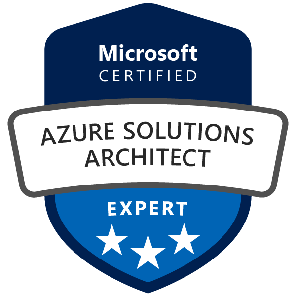{data-gallery="badges" width=10%}
{data-gallery="badges" width=10%}
{data-gallery="badges" width=10%}
{data-gallery="badges" width=10%}
{data-gallery="badges" width=10%}
{data-gallery="badges" width=10%}
{data-gallery="badges" width=10%}
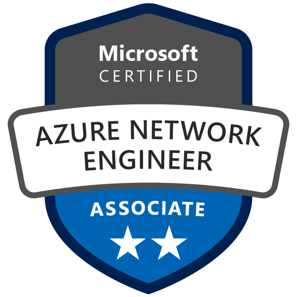{data-gallery="badges" width=10%}
{data-gallery="badges" width=10%}
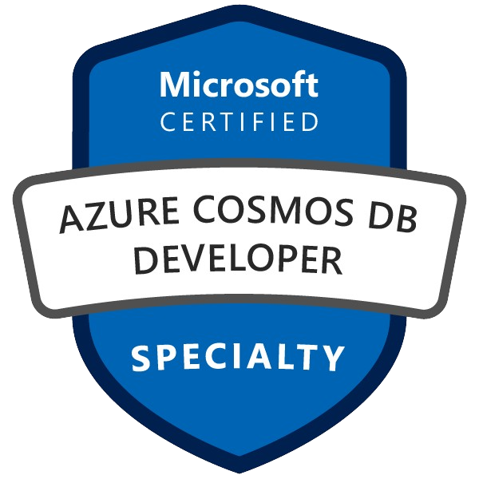{data-gallery="badges" width=10%}
{data-gallery="badges" width=10%}
{data-gallery="badges" width=10%}
{data-gallery="badges" width=10%}
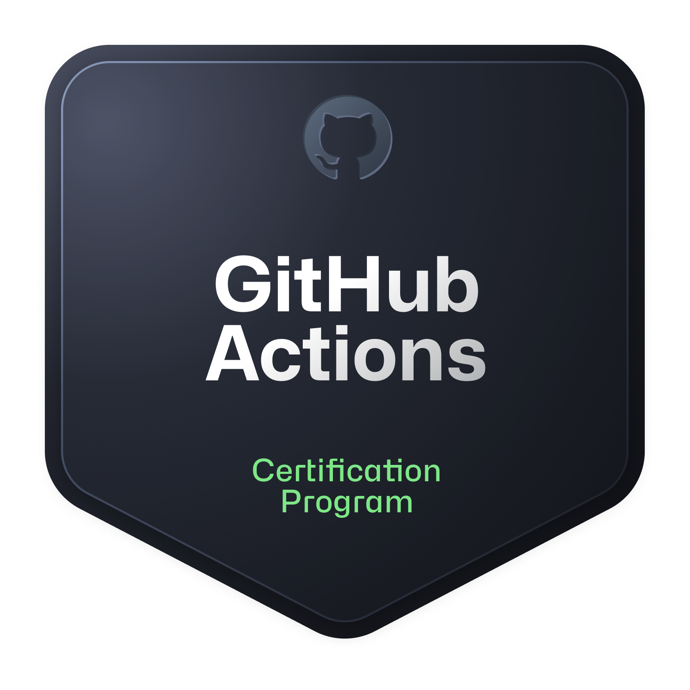{data-gallery="badges" width=10%}
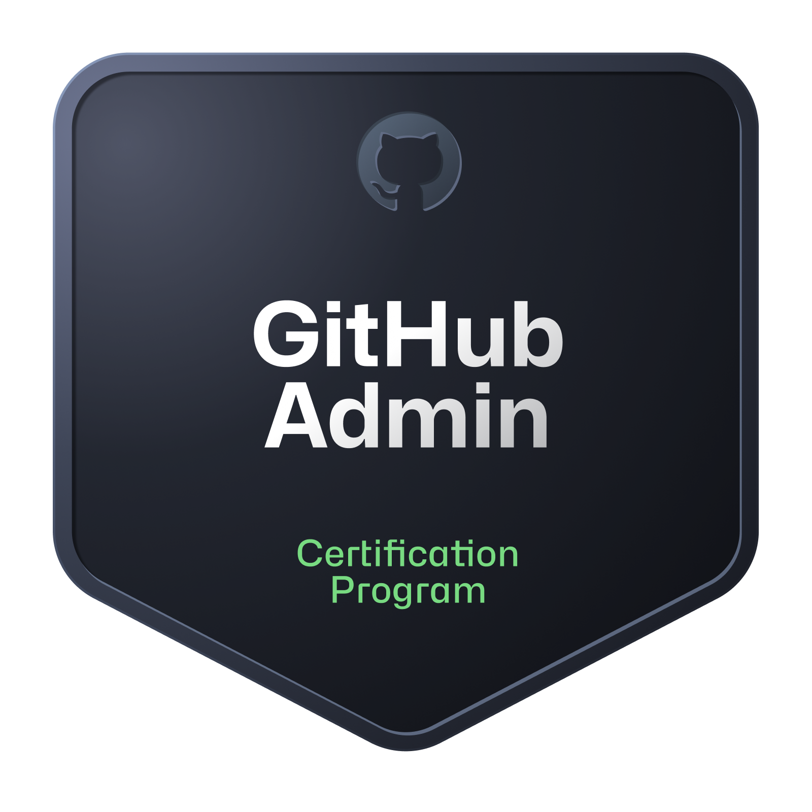{data-gallery="badges" width=10%}
{data-gallery="badges" width=10%}
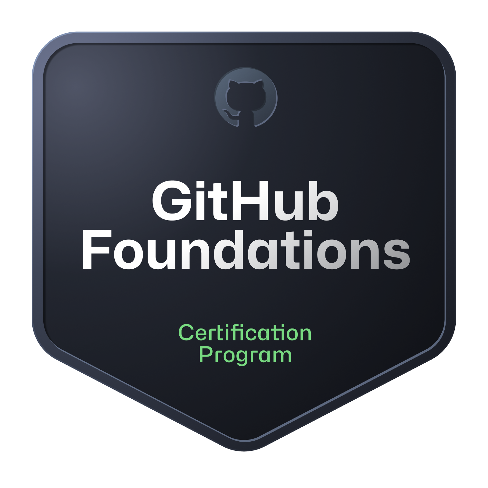{data-gallery="badges" width=10%}
{data-gallery="badges" width=10%}
{data-gallery="badges" width=10%}
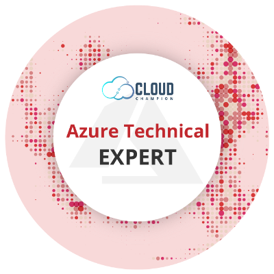{data-gallery="badges" width=10%}
{data-gallery="badges" width=10%}
{data-gallery="badges" width=10%}
{data-gallery="badges" width=10%}
{data-gallery="badges" width=10%}
{data-gallery="badges" width=10%}
{data-gallery="badges" width=10%}
{data-gallery="badges" width=10%}
{data-gallery="badges" width=10%}
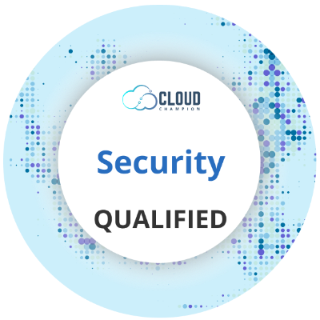{data-gallery="badges" width=10%}
{data-gallery="badges" width=10%}
{data-gallery="badges" width=10%}
{data-gallery="badges" width=10%}
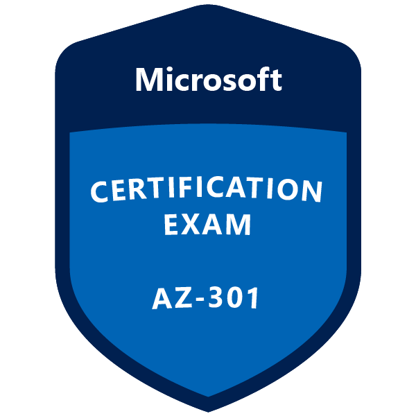{data-gallery="badges" width=10%}
{data-gallery="badges" width=10%}
{data-gallery="badges" width=10%}
{data-gallery="badges" width=10%}
{data-gallery="badges" width=10%}
{data-gallery="badges" width=10%}
{data-gallery="badges" width=10%}
{data-gallery="badges" width=10%}
{data-gallery="badges" width=10%}
{data-gallery="badges" width=10%}
{data-gallery="badges" width=10%}
{data-gallery="badges" width=10%}
{data-gallery="badges" width=10%}
{data-gallery="badges" width=10%}
{data-gallery="badges" width=10%}
{data-gallery="badges" width=10%}
{data-gallery="badges" width=10%}
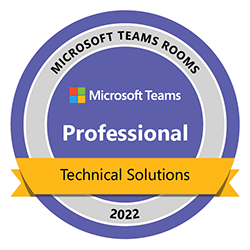{data-gallery="badges" width=10%}
{data-gallery="badges" width=10%}
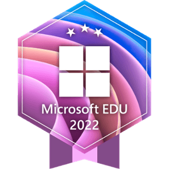{data-gallery="badges" width=10%}
{data-gallery="badges" width=10%}
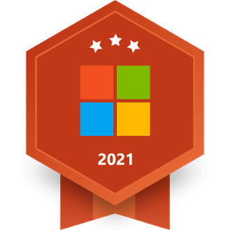{data-gallery="badges" width=10%}
{data-gallery="badges" width=10%}
{data-gallery="badges" width=10%}
{data-gallery="badges" width=10%}
{data-gallery="badges" width=10%}
{data-gallery="badges" width=10%}
{data-gallery="badges" width=10%}
